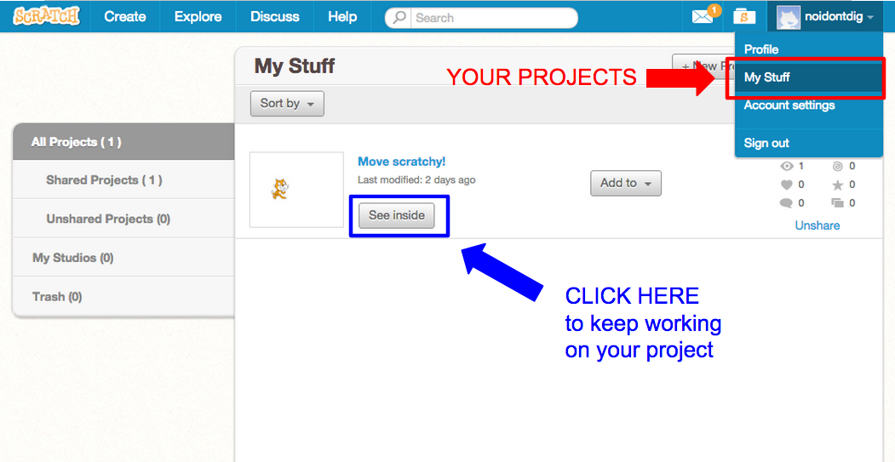
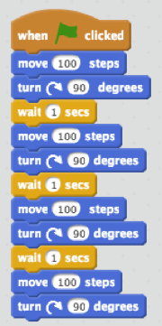
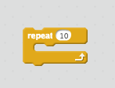

# Lesson 23 - Programming with Scratch!

## Do Now:

1. Go to [www.scratch.mit.edu](www.scratch.mit.edu)
2. Find the project you started yesterday and finish it!

3. If you're done, make Scratchy walk in a **CIRCLE**
4. Now, make Scratchy walk in a **FIGURE EIGHT (8)**

## Yesterday's project

* Here is the code to make Scratchy walk in a square:

* Make Scratchy walk in a square using the `Repeat` block:

