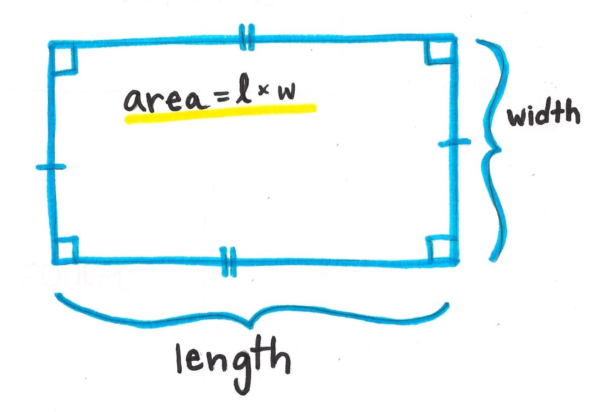

# Lesson 23 - Programming with Scratch!

## Do Now:

1. Go to [www.scratch.mit.edu](www.scratch.mit.edu)
2. Find the project you started yesterday and finish it!

3. If you're done, make Scratchy walk in a **CIRCLE**
4. Now, make Scratchy walk in a **FIGURE EIGHT (8)**

## Yesterday's project

* Here is the code to make Scratchy walk in a square:

* Make Scratchy walk in a square using the `Repeat` block:

## Join Scratch

1. Go to [www.scratch.mit.edu](www.scratch.mit.edu)
2. Click "Join Scratch"
3. Choose a username and create an account!

## YOU DO: Calculate the area of a rectangle!

Using the knowledge you just learned from creating the hello program, create a program that can calculate the area of a rectangle.

 1. The program must first ask the user for the width of the rectangle.
 2. Store that user input in a variable called **width**
 3. Repeat steps 1 & 2 for the rectangle's **height**
 4. Create a third variable called **area**
 5. Using the **Operators** block, set the **area** variable to the product of **width** x **height**
 6. Now you can use the **Say** block to have Scratchy tell the user the area of the rectangle.
